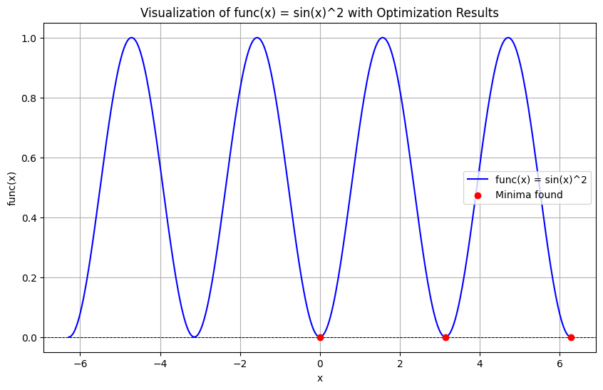
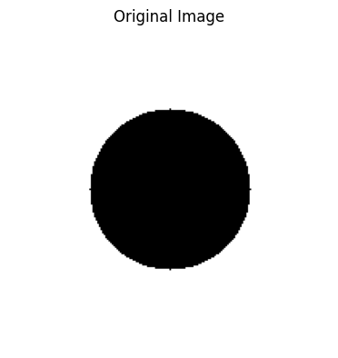
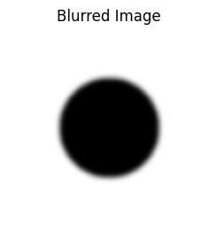
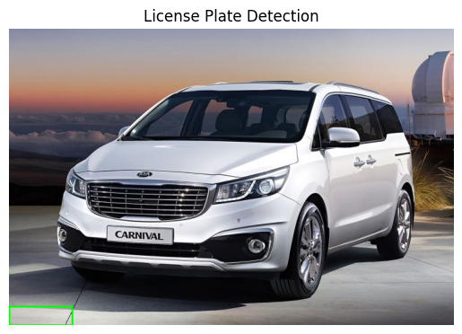
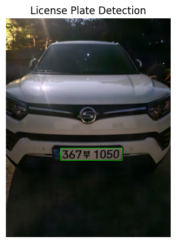

# scipy_optimization_image_processing
Scipy를 활용한 함수 최적화 및 OpenCV & Tesseract OCR을 이용한 이미지 처리 실험

# first_scipy.ipynb

## 📌 개요
2024년 9월 14일에 이 프로젝트는 **Scipy 라이브러리를 활용한 최적화 및 OpenCV 이미지 처리 시험**입니다.  
전자공학과 전공서적에서 보여준 내용을 직접 코드로 구현하며, 다양한 최적화 기법과 이미지 필터링을 적용해 보았습니다.

## 🛠️ 사용한 기술
- `Scipy.optimize`를 이용한 함수 최소항 찾기
- `Matplotlib`을 활용한 데이터 시각화
- `OpenCV`를 활용한 이미지 처리 및 Gaussian Blur 필터 적용
- `Pytesseract`를 이용한 차량 번호판 인식 (OCR)
- Google Colab 환경에서 실행 가능

---

## 🔹 주요 시험 내용

### 1️⃣ Scipy를 활용한 최적화 시험
- 특정 수식의 최소값을 찾는 방법 실습
- 여러 개의 초기 추정값을 사용하여 최적화 성능 비교

#### ✔️ 실행 코드 예시
```python
from scipy import optimize

# 최소화할 함수 정의
def func(x):
    return (x - 3) ** 2

# 함수의 최소값 찾기
result = optimize.minimize(func, x0=0)
print("Minimum value:", result.fun)  # 결과값 출력
```
#### ✔️ 실행 결과
```
Minimum value: 2.5388963550532293e-16
```

---

### 2️⃣ Scipy와 Matplotlib을 활용한 다중 최소항 시각화
- `sin^2(x)` 함수의 다중 최소항을 찾고 그래프 시각화

#### ✔️ 실행 코드 예시
```python
import numpy as np
from scipy import optimize
import matplotlib.pyplot as plt

def func(x):
    return np.sin(x) ** 2

# 여러 개의 초기 추정값 설정
initial_guesses = [0, 2, 5]
results = []

for guess in initial_guesses:
    result = optimize.minimize(func, x0=guess)
    results.append((guess, result.fun, result.x[0]))

# 시각화
x = np.linspace(-2 * np.pi, 2 * np.pi, 400)
y = func(x)

plt.figure(figsize=(10, 6))
plt.plot(x, y, label='func(x) = sin(x)^2', color='blue')
plt.scatter([res[2] for res in results], [res[1] for res in results], color='red', zorder=5, label='Minima found')
plt.axhline(y=0, color='black', linestyle='--', linewidth=0.7)
plt.title('Visualization of func(x) = sin(x)^2 with Optimization Results')
plt.xlabel('x')
plt.ylabel('func(x)')
plt.legend()
plt.grid(True)
plt.show()
```
#### ✔️ 실행 결과


---

### 3️⃣ OpenCV를 활용한 이미지 처리 시험
- `cv2.circle()`을 이용해 흰 배경 위에 검은 원 생성
- Gaussian Blur 필터를 적용하여 흐림 효과 실험

#### ✔️ 실행 코드 예시
```python
import numpy as np
import cv2
import matplotlib.pyplot as plt

# 이미지 생성
height, width = 200, 200
image = np.ones((height, width, 3), dtype=np.uint8) * 255  # 흰 배경

# 검은 원 그리기
cv2.circle(image, (width//2, height//2), 50, (0, 0, 0), -1)

# Gaussian 블러 적용
blurred_image = cv2.GaussianBlur(image, (15, 15), 0)

# 결과 시각화
plt.figure(figsize=(10, 5))

plt.subplot(1, 2, 1)
plt.imshow(cv2.cvtColor(image, cv2.COLOR_BGR2RGB))
plt.title('Original Image')
plt.axis('off')

plt.subplot(1, 2, 2)
plt.imshow(cv2.cvtColor(blurred_image, cv2.COLOR_BGR2RGB))
plt.title('Blurred Image')
plt.axis('off')

plt.show()
```
#### ✔️ 실행 결과
 

---

### 4️⃣ 차량 번호판 인식 (OCR)
- `Pytesseract`를 활용하여 차량 번호판을 감지하고 문자 추출

#### ✔️ 실행 코드 예시
```python
import cv2
import pytesseract

# 번호판 문자 인식
text = pytesseract.image_to_string(plate_image, config='--psm 8')
print("Detected License Plate Text:", text)
```
#### ✔️ 실행 결과
 

## 🔗 관련 기술 및 패키지
- `Scipy`
- `NumPy`
- `Matplotlib`
- `OpenCV`
- `Pytesseract`
